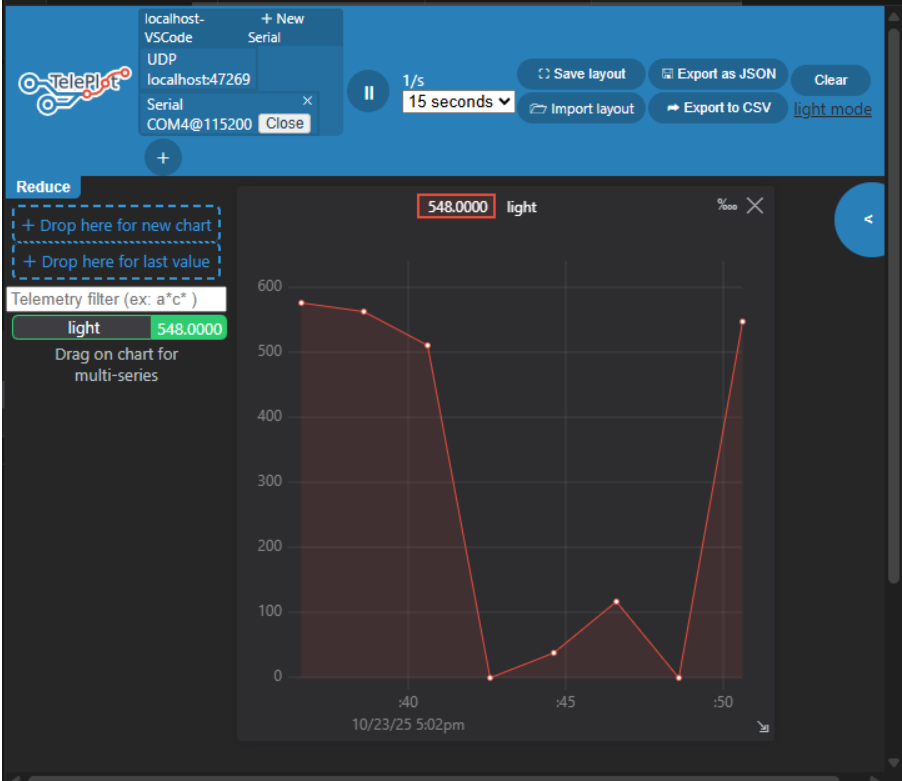

#  Dự án: Đọc cảm biến ánh sáng (LDR) với ESP32 & Teleplot

## Giới thiệu
Trong dự án này, ESP32 được sử dụng để đọc giá trị ánh sáng tương đối từ cảm biến quang trở (LDR) thông qua chân ADC.
Giá trị thu được sẽ được gửi qua UART và hiển thị dưới dạng đồ thị thời gian thực trên Teleplot trong VS Code, giúp dễ dàng quan sát sự thay đổi cường độ ánh sáng theo thời gian.

## ⚙️ Thành phần phần cứng
- **ESP32 DevKit V1**
- **LDR (CdS)**
- **Điện trở 10kΩ** (tạo mạch chia áp)
- **Nguồn 3.3V**

